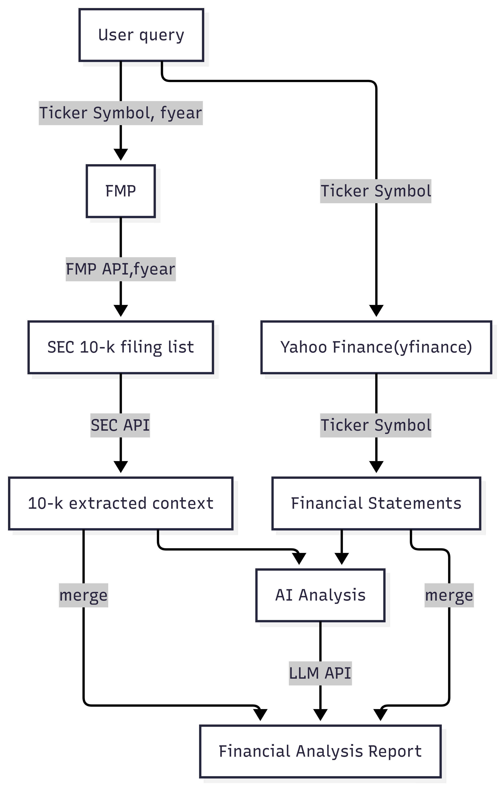

# Stock Financial Statement Analysis

Fundamental analysis regarding company's financial statements can be a really challenging and tedious task for common investors. And even with the calculated ratios, it is still hard to interpret it into an understandable format.

## Description:
This project aims to analyze the financial statements of a given stock using varous reports from different sources including SEC Yahoo Finance. The analysis will focus on the fianncial fundamentals to give investors an easy understanding of a company operation.

And with the help of AI, further translate all financial data into a plain, simple, and understandable format.

## Features:
- Retrieve official company filings, latest and historical financial data from authorities and financial market
- Analyze financial data summarizing the analysis results

## Architecture flow map:

## Setup step-by-step with command line:    
1. Clone the repository `git clone https://github.com/raymond0208/finstatments_analysis.git` 
2. Install the required packages `pip install -r requirements.txt`
3. Set up the environment variables by creating a `.env` file in the project root directory. This file should contain the API keys. You can refer to the `.env.example` file for the format.
4. Run the script `python3.11 analyze_BS_w_param.py` in your terminal , and you will be prompted to enter the company ticker symbol, fiscal year, report save path. **PLEASE USE STOCK SYMBOL INSTEAD OF NAME,LIKE 'GOOGL' FOR GOOGLE, 'AAPL' FOR APPLE ETC.**
5. The report will be saved in the specified path

## Prerequisites:
- The script is designed with Python 3.11
- You need to apply for the API keys from Financial Modeling Prep (FMP_API_KEY) and Securities and Exchange Commission (SEC_API_KEY)
- Yahoo Finance(yfinance) doesn't need an API key,however you will get rate limit if request too frequently.
